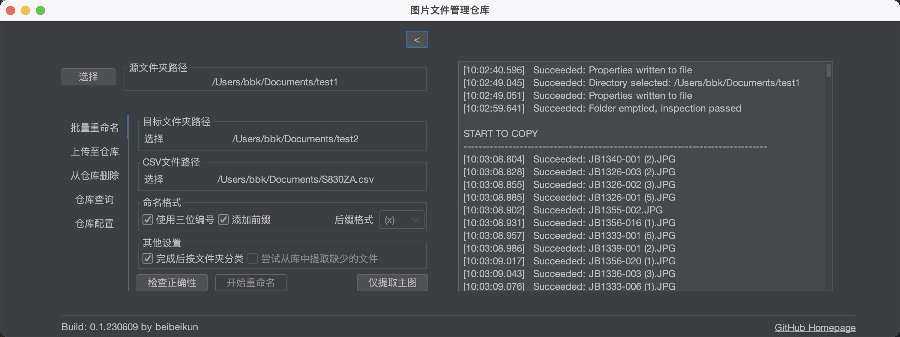

# _ImgManagementSystem_

 
    

        
    

    

        
        
        
    

 

IMS是一个C/S架构跨平台自动图片仓库管理工具，目前尚处在早期开发阶段

IMS 是一款免费开源软件，地址：https://github.com/beibeikun/ImgManagementSystem

开发阶段GUI预览图（预览图具有时效性，仅供参考）：

## 功能开发（更新中）

- **~~批量自动重命名~~**
- **~~数据库连接~~**
- **~~文件库连接~~**
- **批量文件处理**
- **OCR识别图片内容并自动重命名**
- **~~用户登录~~（在[IMS_web](https://github.com/beibeikun/IMG_ManagementSystem_web)开发）**
- **~~管理系统~~（在[IMS_web](https://github.com/beibeikun/IMG_ManagementSystem_web)开发）**

## 已知问题（待更新）

- **~~无法执行按文件夹分类~~**
- **~~使用三位编号时存在问题~~**
- **~~无法正确记录用户之前所选择的文件路径~~**
- **不存在缩略图路径时报错**
- **压缩上传耗时过长，可加入多线程优化**

## 相关项目

- [Flatlaf](https://github.com/JFormDesigner/FlatLaf)，IMS所使用的Java Swing外观库。
- [IWS](https://github.com/beibeikun/ImgWorkflowSystem)，IWS，一个C/S架构跨平台图片拍摄工作流工具。
- [Tesseract-OCR](https://github.com/tesseract-ocr/tesseract)，开源OCR引擎

## 更新日志

  
点击此处展开/折叠

- **2023/06/08**-完成上传至仓库与查询仓库功能，新增缩略图策略
- **2023/06/05**-修复部分已知问题，更新部分算法，兼容多语言
- **2023/06/02**-可以进行数据库连接
- **2023/06/01**-新UI基础功能可以使用
- **2023/05/31**-重构部分功能模块
- **2023/05/30**-重构UI界面

